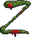

# Ascent Z

A retro zombie shooter made in Unity. This game was my submission for the course 'COMP6540: Game Development' at Australian National University, Semester 2, 2024, winning the Outstanding Game Award.

You can try the game [here](https://play.unity.com/en/games/a5043353-f396-4ddd-901c-a0f7d3a0b165/anu2024-group-5-ascent-z) on Unity Play.

# Attributions

All SFX and many sprite assets, apart from the original assets created by myself, were sourced from [Open Game Art](opengameart.org). See file 'attributions.pdf' for details. 

# Contributors

- Lochlan Graf
- Sean Barnes
- Can Cevik
